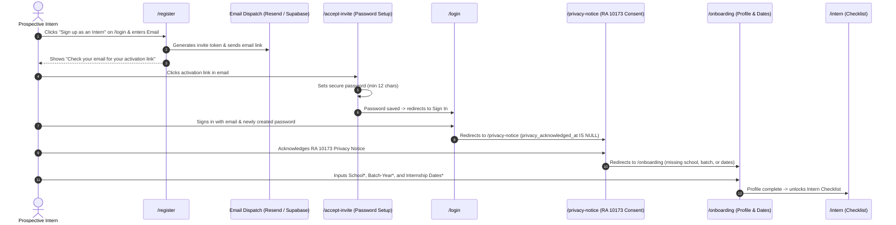

# Feature Specification: Intern Self-Registration & Staged Onboarding Flow

**Document Number:** `17-intern-self-registration.md`  
**Status:** Approved / Revised Specification  
**Author:** Pair Programming Agent (Antigravity)  
**Target Delivery:** Post-Handover Enhancement  
**Related Documents:** `prd-intern-docflow.md`, `05-security.md`, `07-design-system.md`, `11-frontend-ui-rules.md`, `12-backend-security-rules.md`

---

## 1. Executive Summary & Revised Workflow

The intern self-registration flow uses a **staged, low-friction onboarding model** rather than requiring prospective interns to fill out all profile fields upfront:

1. **Quick Sign-Up via Email Entry (`/register`)**:
   Prospective interns enter only their **Email Address** on `/register`.
2. **Email Verification & Password Creation**:
   The system generates an activation link and sends an invitation/notification email via Resend / Supabase Auth. The intern clicks the link to set up their **Password** (min 12 characters per `05-security.md`).
3. **Mandatory Privacy Notice Gate (`/privacy-notice`)**:
   Upon logging in for the first time, the intern is routed through the RA 10173 Privacy Notice to acknowledge consent before accessing any personal document features.
4. **Cohort Onboarding & Profile Setup (`/onboarding`)**:
   Once authenticated and consent is recorded, the intern lands on the **Onboarding Page**, where they enter their cohort metadata:
   - **School / University \*** (Required)
   - **Batch / Academic Year \*** (Required)
   - **Internship Start & End Dates \*** (Required)
5. **Dashboard Access (`/intern`)**:
   Upon completing onboarding, the intern is directed to their requirement checklist.

---

## 2. User Journey & Workflow Diagram



---

## 3. UI/UX Specifications

### 3.1. Login Page Entry Point (`src/app/(auth)/login/page.tsx` & `LoginForm.tsx`)
* **Placement**: Located directly beneath the primary "Sign in" button.
* **Aesthetics**:
  * Copy: *"Don't have an account yet?"* with link: **"Sign up as an Intern"** pointing to `/register`.
  * Visual style: High-contrast, brand-aligned (`#1B3251` Navy with `#C9400A` Orange accent).

### 3.2. Single-Field Registration Screen (`src/app/(auth)/register/page.tsx` & `RegisterForm.tsx`)
* **Layout**: Asymmetric split layout matching `/login`.
* **Form Inputs**:
  * **Email Address (`email` - Required \*)**: Validated email string with HTML5 type `email`.
  * **CTA Button**: **"Send Activation Link"** with loading state.
  * **Navigation**: Link back to `/login` (*"Already have an account? Sign in"*).
* **Success State**:
  * When submitted, replaces the form with an informative notification card:
    * Icon: ✉️ Envelope / Checkmark badge.
    * Heading: *"Check your email"*.
    * Body: *"We sent an account setup link to **you@school.edu.ph**. Open the link to set your password and begin onboarding."*
    * Action button: *"Return to Sign in"*.

### 3.3. Password Setup (`src/app/(auth)/accept-invite/page.tsx`)
* The email link directs the intern to `/accept-invite`.
* Validates token from URL hash or query params (`token_hash` / `code`).
* Prompts for:
  * **Password (Required \*)**: Minimum 12 characters with Show/Hide toggle.
  * **Confirm Password (Required \*)**: Must match password.
* On submission, updates password in Supabase Auth and redirects to `/login?reason=password_set` or directly signs the user in.

### 3.4. Mandatory Onboarding Screen (`src/app/onboarding/page.tsx`)
* Triggered automatically after login when `school`, `batch`, or internship dates are missing.
* **Form Inputs**:
  1. **School / University \***:
     * Label: `School / University *`
     * Input: Text field (e.g. `University of the Philippines`, `De La Salle University`, `Polytechnic University of the Philippines`).
     * Max length: 200 characters.
  2. **Batch / Academic Year \***:
     * Label: `Batch / Academic Year *`
     * Input: Text field (e.g. `Batch 2026-A`, `Summer 2026`, `2026-Q1`).
     * Max length: 100 characters.
  3. **Internship Start Date \***: Date picker (`start`).
  4. **Internship End Date \***: Date picker (`end`).
* **CTA Button**: **"Complete Profile & Enter Portal"**.
* Saves metadata to `public.users` (`school`, `batch`, `internship_start`, `internship_end`) and redirects to `/intern`.

---

## 4. Technical Architecture & Security Rules

### 4.1. Strict Default Role (`intern`)
* When an intern initiates self-registration, the backend creates or registers the user identity with role `'intern'` hardcoded.
* Under no circumstances can a public registrant specify or obtain `approver`, `admin`, or `system_admin` roles. Staff roles remain strictly invite-only by System Administrators.

### 4.2. Append-Only Audit Logging
Events recorded in `audit_log`:
1. **`INTERN_REGISTRATION_REQUESTED`**: Triggered when the intern enters their email on `/register`.
   ```json
   {
     "action": "INTERN_REGISTRATION_REQUESTED",
     "target_type": "auth",
     "payload": { "email": "intern@school.edu.ph" },
     "source_ip": "<request-ip>"
   }
   ```
2. **`USER_REGISTERED`**: Triggered when the user confirms their password and creates their profile.
3. **`INTERN_ONBOARDING_COMPLETED`**: Triggered when the intern submits their school, batch, and dates on `/onboarding`.

### 4.3. Navigation & Route Protection (`src/proxy.ts` & `src/app/page.tsx`)
* **`src/proxy.ts`**: Allows public unauthenticated access to `/login`, `/register`, and `/accept-invite`.
* **`src/app/page.tsx` Root Dispatcher**:
  ```typescript
  if (!userData?.privacy_acknowledged_at) {
    redirect('/privacy-notice');
  }

  if (role === 'intern') {
    if (!userData?.school || !userData?.batch || !userData?.internship_start || !userData?.internship_end) {
      redirect('/onboarding');
    }
    redirect('/intern');
  }
  ```

---

## 5. Implementation Plan & File Modifications

| File | Action | Purpose |
|---|---|---|
| `docs/17-intern-self-registration.md` | **[MODIFY]** | This updated architectural specification. |
| `src/components/RegisterForm.tsx` | **[MODIFY]** | Simplify to email-only registration with "Check your email" confirmation screen. |
| `src/app/(auth)/register/page.tsx` | **[MODIFY]** | Handle email-only submission and activation email dispatch. |
| `src/app/onboarding/page.tsx` | **[MODIFY]** | Add `School / University *` and `Batch / Academic Year *` input fields alongside internship dates. |
| `lib/data/users.ts` | **[MODIFY]** | Update onboarding profile handler to save `school` and `batch` in addition to start/end dates. |
| `lib/data/auth.ts` | **[MODIFY]** | Update `registerIntern(email: string)` to generate invite/activation link and send via email. |
| `__tests__/intern-registration.test.ts` | **[MODIFY]** | Update tests for email-only registration and onboarding metadata submission. |

---

## 6. Verification & Quality Gates

1. **Email-Only Registration**:
   * Visit `/register` -> enter email -> assert success screen appears ("Check your email").
   * Verify an invite/activation email is dispatched via Resend / Supabase Auth.
2. **Password Creation**:
   * Open activation link -> arrive at `/accept-invite` -> enter 12+ character password -> assert password saves successfully.
3. **Privacy Notice Gate**:
   * Sign in -> assert user is directed to `/privacy-notice` before any other page.
4. **Onboarding Profile Completion**:
   * Acknowledge privacy notice -> assert user lands on `/onboarding`.
   * Verify form requires `School / University *`, `Batch / Academic Year *`, `Start Date *`, and `End Date *`.
   * Submit form -> assert `public.users` row contains all metadata and user is redirected to `/intern` checklist.
