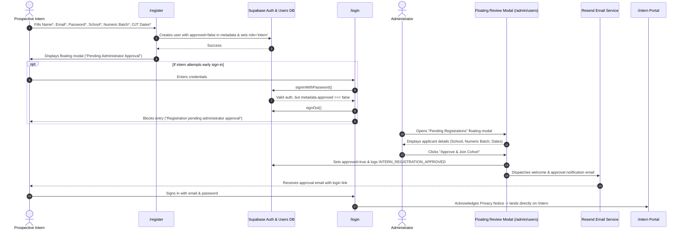

# Feature Specification: Intern Self-Registration & Admin Approval Flow

**Document Number:** `17-intern-self-registration.md`  
**Status:** Approved Specification  
**Author:** Pair Programming Agent (Antigravity)  
**Target Delivery:** Post-Handover Enhancement  
**Related Documents:** `prd-intern-docflow.md`, `05-security.md`, `07-design-system.md`, `11-frontend-ui-rules.md`, `12-backend-security-rules.md`

---

## 1. Executive Summary & Core Workflow

Prospective interns register their account directly with all required details upfront. To maintain cohort integrity and prevent unauthorized access, **accounts are submitted in a pending state with login locked until approved by an administrator**:

1. **Upfront Registration Form (`/register`)**:
   Prospective interns provide:
   - **Full Name \*** (Required)
   - **Email Address \*** (Required)
   - **Password \*** (Required, min 12 characters per `05-security.md`)
   - **Confirm Password \*** (Required, must match password)
   - **School / University \*** (Required)
   - **Batch Number \*** (Required, **numbers only**, e.g. `5`, `2026`)
   - **Start of OJT \*** (Required date)
   - **End of OJT \*** (Required date, must be after start and $\le 365$ days)
2. **Pending Approval Floating Modal (`/register`)**:
   Upon submission, a floating modal dialog informs the applicant that registration was submitted and login is temporarily locked until an administrator admits them to the cohort. Resend will send an email notification upon approval.
3. **Login Protection Gate (`/login`)**:
   If an applicant attempts to sign in before approval, the system signs them out immediately and presents a pending approval warning:
   *"Your registration is pending administrator approval. You will receive an email once admitted to the cohort."*
4. **Admin Review Floating Modal (`/admin/users`)**:
   Administrators review pending applicants via a floating modal triggered from `/admin/users` (with a badge indicating pending count). Inside the modal, the admin views applicant details and clicks **"Approve & Join Cohort"**.
5. **Resend Notification & First Login**:
   Upon admin approval, Resend delivers a welcome email with a direct login link. The intern signs in with their chosen password, acknowledges the RA 10173 Privacy Notice (`/privacy-notice`), and enters `/intern` directly (bypassing the deprecated `/onboarding` route).

---

## 2. User Journey & Workflow Diagram



---

## 3. UI/UX Specifications

### 3.1. Registration Screen (`src/app/(auth)/register/page.tsx` & `RegisterForm.tsx`)
* **Layout**: Split asymmetric layout matching `/login`.
* **Field Rules**:
  * **Full Name (`fullName`)**: Min 2, max 100 characters.
  * **Email (`email`)**: Valid email format.
  * **Password (`password`)**: Min 12 characters with show/hide eye toggle.
  * **Confirm Password (`confirmPassword`)**: Must match password with show/hide toggle.
  * **School / University (`school`)**: Min 2, max 200 characters.
  * **Batch Number (`batch`)**: **Strictly numeric digits only** (`/^\d+$/`, `type="number"`, `inputMode="numeric"`, `min="1"`).
  * **Start of OJT (`start`)**: Valid ISO date.
  * **End of OJT (`end`)**: Valid ISO date > `start`, max 12-month span.
* **Success Modal (Floating)**:
  * Modal with backdrop blur (`backdrop-blur-xs`) and entrance transition (`animate-in zoom-in-95`).
  * Amber badge: `Pending Approval`.
  * Title: `Registration Submitted!`.
  * Message: Informs user that login is locked until an administrator admits them to the cohort, and Resend will notify them via email.
  * CTA: `Return to Sign in` button linking to `/login`.

### 3.2. Login Screen (`src/app/(auth)/login/page.tsx` & `LoginForm.tsx`)
* **Pending Notice**:
  * If a user attempts to sign in while `user_metadata.approved === false`, login is refused, session is terminated via `signOut()`, and a prominent amber alert banner is displayed:
    *"Your registration is pending administrator approval. You will receive an email once admitted to the cohort."*

### 3.3. Admin Review Floating Modal (`src/components/PendingRegistrationsModal.tsx`)
* **Trigger Button**:
  * Positioned in `/admin/users` header alongside search and filters.
  * Amber styling with badge: `Pending Registrations [count]`.
* **Modal Dialog**:
  * Full floating modal dialog (`role="dialog"` and `aria-modal="true"`).
  * Displays applicant list: Full Name, Email, School, Numeric Batch #, and OJT Start & End Dates.
  * Action button: **"Approve & Join Cohort"** with loading state (`Admitting...`).
  * Instant optimistic UI updates removing admitted interns from the list.
  * Empty state graphic when no pending registrations remain.

### 3.4. Bypassing `/onboarding`
* The standalone `/onboarding` route is bypassed to eliminate route confusion.
* Any navigation to `/onboarding` redirects directly to `/`.
* Interns transition straight from `/privacy-notice` to `/intern`.

---

## 4. Security & Compliance Architecture

### 4.1. Strict Default Role & Metadata Guard
* Public self-registration hardcodes role `'intern'` in `public.users`.
* Public registrants cannot elevate roles or set `approved: true`.
* `user_metadata.approved` is set to `false` during registration and only switched to `true` by an authenticated `admin` or `system_admin` via `approveInternRegistration()`.

### 4.2. Append-Only Audit Logging
Events recorded in `audit_log`:
1. **`INTERN_REGISTRATION_REQUESTED`**: Triggered upon registration form submission.
   ```json
   {
     "action": "INTERN_REGISTRATION_REQUESTED",
     "actor_id": "<intern_user_id>",
     "target_id": "<intern_user_id>",
     "target_type": "users",
     "payload": {
       "full_name": "Juan Dela Cruz",
       "email": "juan@school.edu.ph",
       "school": "University of the Philippines",
       "batch": "5",
       "internship_start": "2026-09-01",
       "internship_end": "2026-12-01",
       "approved": false
     }
   }
   ```
2. **`INTERN_REGISTRATION_APPROVED`**: Triggered when an administrator admits the intern.
   ```json
   {
     "action": "INTERN_REGISTRATION_APPROVED",
     "actor_id": "<admin_user_id>",
     "target_id": "<intern_user_id>",
     "target_type": "users",
     "payload": {
       "intern_email": "juan@school.edu.ph",
       "intern_name": "Juan Dela Cruz",
       "school": "University of the Philippines",
       "batch": "5"
     }
   }
   ```

---

## 5. Verification & Test Coverage

1. **Numeric Batch Validation**:
   * Attempt non-numeric batch strings (e.g. `Batch-A`, `Summer`, `2026-Q1`) $\to$ Rejected.
   * Attempt numeric strings (e.g. `5`, `2026`) $\to$ Accepted.
2. **Password Validation**:
   * Minimum 12 characters enforced.
   * Mismatched confirm password rejected.
3. **Login Prevention for Unapproved Accounts**:
   * Unapproved users receive `isPendingApproval: true` and are logged out.
4. **Admin Approval & Resend Dispatch**:
   * Administrators can approve pending registrations via the floating modal.
   * Approval updates metadata, fires Resend email notification, and inserts audit record.
